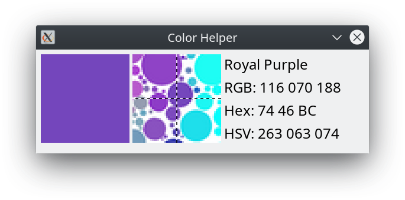

# Color Helper

Simple Linux tool which identifies the color of the pixel the user is hovering over. The tool displays both the RGB value of the pixel and the name of the color it matches. Directed towards individuals with colorblindness who might have trouble putting a name to a specific color on the screen.



Dependencies:
* GTK3.0
* X11

To run:
```
make -j8
./color_helper
```

## Map file
Color names are stored in a map file with their RGB values. The map file is a newline-separated list where each item is of the format `Color name,R,G,B`. Simple example:

```
Red,255,0,0
Green,0,255,0
Blue,0,0,255
```

To identify a color's name from its RGB value, the tool finds the closest color from the map file. So, a larger list of colors will result in more specific color naming.
